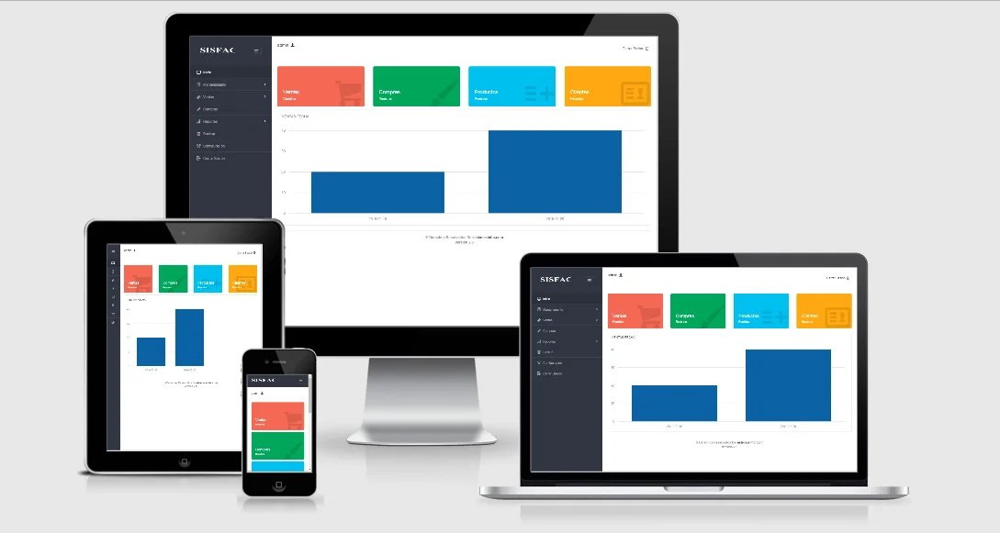

# meteorologico_social 🚀

Sistema web meteorológico comunal, diseñado para capturar información meteorológica en tiempo real de vuestra comuna, con actualizaciones a intervalos de pocas horas durante el día. Este sistema puede integrarse con alertas tempranas, proporcionando datos precisos y oportunos para organizaciones públicas o privadas, mejorando la capacidad de respuesta ante condiciones climáticas adversas.
